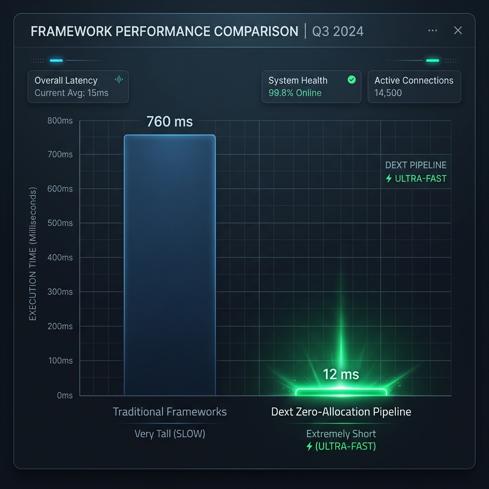

> **Lê em português?** Este README está em inglês. A versão completa em português — com os mesmos exemplos, o livro e o mapa de features — está em [README.pt-br.md](README.pt-br.md). Se o português for mais confortável, clique e leia o documento inteiro por lá, em vez de passar o olho num atalho.

# Dext Framework 1.0
**Native full-stack for Delphi.**

<p align="center">
  
</p>

The Delphi compiler was never the bottleneck. The missing piece was the infrastructure.

For years, a modern Object Pascal backend meant stitching a dozen libraries: one for DI, one for HTTP, one for ORM, one for tests. Each with its own dialect. None of them slept in the same house.

**Dext 1.0** is that infrastructure. One ecosystem — dependency injection, ORM, web pipeline, telemetry, and testing — compiled native. No JIT. No cold start. No patchwork.

> **"Simplicity is Complicated."** — *Rob Pike*

A Minimal API fits on one screen because the engine underneath does not. UTF-8 JSON, DI, binding, validation, Direct-to-JSON: the ceremony lives in the framework.

> **"Make what is right easy and what is wrong difficult."** — *Steve "Ardalis" Smith*

Reading a catalog is an entity. Changing the world is a command with a rule. The test is born in the constructor. With Dext, the right path is the short one.

And it is **Apache 2.0**: free for the twenty-year ERP and for the product that does not have a name yet.

---

## Why this matters now

If the team is glancing at C# because “Delphi has no industry-standard stack,” Dext closes that gap without rewriting the system.

Functional parity with ASP.NET Core and Entity Framework Core, in the language you already ship, plus what the managed runtime does not give away: a native binary, a small memory footprint, instant startup.

- [**Dext vs .NET: architecture**](Docs/Comparison/Dext_vs_DotNet_Narrative.md) — modern patterns on a native compiler.
- [**Feature-by-feature matrix**](Docs/Comparison/Feature_Comparison_Dext_vs_DotNet.md) — 60+ items side by side.
- [**ORM capabilities**](Docs/Comparison/Dext_ORM_Capabilities.md) — DbContext, change tracking, JSON, lazy/eager.
- [**Enterprise licensing**](Docs/Comparison/Open_Source_Licensing_Enterprise.md) — why Apache 2.0 is safe for commercial use.

---

## The book

This is not a feature catalog. It is a real corporate product — **Dext Faturamento** — built from scratch across five labs: Minimal APIs, persistence, multi-tenant SaaS, JWT, jobs, Redis, Hubs, Docker, gRPC, and tools for AI agents. The model stays yours. The agent does not get to invent SQL.

<p align="center">
  
</p>

**Desenvolvimento Web Profissional com Delphi e Dext Framework** — Cesar Romero, 1st edition, 2026. ISBN 978-65-02-32503-2.

- **Print in Brazil (UICLAP):** [loja.uiclap.com/titulo/ua197387](https://loja.uiclap.com/titulo/ua197387)
- **Paperback on Amazon:** [amazon.com/dp/6502325033](https://www.amazon.com/dp/6502325033)
- **Kindle (Brazil):** [amazon.com.br/dp/B0HGYTSYYY](https://www.amazon.com.br/dp/B0HGYTSYYY)
- **Kindle (global):** [amazon.com/dp/B0HGYTSYYY](https://www.amazon.com/dp/B0HGYTSYYY)
- **Lab source:** [github.com/dotpas/book-dext-web](https://github.com/dotpas/book-dext-web)

The English edition is in final review.

---

## Where to go after this README

The README is the taste. The map lives under `Docs`.

1. **[The Dext Book](Docs/Book/README.md)** — the official guide: install, Minimal APIs, ORM, security, real-time, CLI, MCP. Start with [Where to start](Docs/Book/01-getting-started/where-to-start.md) and [Installation](Docs/Book/01-getting-started/installation.md).
2. **[Complete features index](Docs/Features_Implemented_Index.md)** — everything 1.0 ships, organized by module, with the implementing unit.
3. **[.NET comparison pack](Docs/Comparison/README.md)** — for the meeting where someone asks “why not migrate?”

The Portuguese editions of the same docs live under [`Docs/Book.pt-br`](Docs/Book.pt-br/README.md) and [`Docs/Features_Implemented_Index.pt-br.md`](Docs/Features_Implemented_Index.pt-br.md).

---

## Where Dext fits

- **High-throughput APIs** — Minimal APIs, Controllers, or `[DataApi]` generating REST from the entity.
- **Web applications** — SSR with the native template engine or Web Stencils, HTMX without a heavy SPA.
- **Real concurrency** — `TAsyncTask`, cancellation tokens, async REST client. No hand-rolled `TThread`.
- **Mobile backends** — the same API for iOS and Android, with JWT, rate limits, and health checks.
- **Legacy that still has to run** — DataSnap, ISAPI/Apache, VCL. Dext lands as a modern foundation without erasing twenty years of ERP.
- **Jobs, microservices, IoT** — persistent background jobs, MQTT, gRPC, Redis.

---

## Five minutes of code

### Minimal API

An endpoint with DI and model binding does not ask for ceremony:

```pascal
program MyAPI;

uses Dext.Web;

begin
  var App := WebApplication;

  App.MapGet('/hello', function: string
  begin
    Result := 'Hello from Dext! Modern full-stack for Delphi.';
  end);

  App.MapPost<TUserDto, IEmailService, IResult>('/register',
    function(Dto: TUserDto; EmailService: IEmailService): IResult
    begin
      EmailService.SendWelcome(Dto.Email);
      Result := Results.Created('/login', 'User successfully registered');
    end);

  App.Run(8080);
end.
```

### Entity, DataAPI, and Smart Properties

Convention over Configuration. The class becomes a table — and, if you want, an API:

```pascal
[Table]
[DataApi('/api/orders')]
TOrder = class
private
  FId: IntType;
  FStatus: Prop<TOrderStatus>;
  FNotes: StringType;
  FTotal: Nullable<CurrencyType>;
  FItems: Lazy<IList<TOrderItem>>;
public
  [PK, AutoInc]
  property Id: IntType read FId write FId;
  property Status: Prop<TOrderStatus> read FStatus write FStatus;
  property Notes: StringType read FNotes write FNotes;
  property Total: Nullable<CurrencyType> read FTotal write FTotal;
  property Items: Lazy<IList<TOrderItem>> read FItems write FItems;
end.
```

### Type-safe ORM

No more magic strings that fail in production. Dext builds the query AST in Pascal:

```pascal
var O := Prototype.Entity<TOrder>;

var Orders := DbContext.Orders
  .Where((O.Status = TOrderStatus.Paid) and (O.Total > 1000))
  .Include('Customer')
  .Include('Items')
  .OrderBy(O.Date.Desc)
  .Take(50)
  .ToList;

DbContext.Products
  .Where(Prototype.Entity<TProduct>.Category = 'Outdated')
  .Update
  .Execute;
```

### Fluent tasks

`TThread` complexity becomes a pipeline. Thread pool, chaining, a safe return to the UI:

```pascal
var CTS := TCancellationTokenSource.Create;

TAsyncTask.Run<TStream>(
  function: TStream
  begin
    Result := AsyncClient.DownloadStream('https://api.company.com/data', CTS.Token);
  end)
  .Then<TReport>(
    function(Stream: TStream): TReport
    begin
      Result := JsonSerializer.Deserialize<TReport>(Stream);
      Stream.Free;
    end)
  .OnComplete(
    procedure(Report: TReport)
    begin
      ShowReport(Report);
    end)
  .OnException(
    procedure(Ex: Exception)
    begin
      ShowError('Process failed: ' + Ex.Message);
    end)
  .Start;
```

### Configuration, Options, and DI

JSON, YAML, User Secrets, environment variables, command line — Twelve-Factor order:

```pascal
  var Builder := WebApplication.CreateBuilder;

  Builder.Configuration
    .AddJsonFile('appsettings.json')
    .AddYamlFile('config.yaml')
    .AddEnvironmentVariables;

  Builder.Services
    .Configure<TDatabaseSettings>(Builder.Configuration.GetSection('Database'))
    .AddSingleton<IEmailService, TSmtpEmailService>
    .AddScoped<IOrderRepository, TDbOrderRepository>;

  var App := Builder.Build;
```

### VCL without giving up the ORM

`TEntityDataSet` puts POCOs on the DBGrid, FastReport, and the Object Inspector. Real design-time: *TFields* and live data in the IDE, without compiling the project.

---

## Dext is not “just CRUD”

Everyone ships CRUD. 1.0 was built for what comes next: scale, governance, and the rest of the week.

### Database as API

Full REST from the entity — paging, filters, roles, and Swagger — with one attribute:

```pascal
[Table, DataApi('/api/products')]
TProduct = class
private
  FId: IntType;
  [Required, MaxLength(100)]
  FName: StringType;
  FPrice: CurrencyType;
public
  [PK, AutoInc]
  property Id: IntType read FId write FId;
  property Name: StringType read FName write FName;
  property Price: CurrencyType read FPrice write FPrice;
end;

App.MapDataApis.Configure<TProduct>(
  DataApiOptions.RequireAuth.RequireWriteRole(['admin'])
);
```

### Native MCP server

Dext exposes Delphi business rules as tools for agents (Claude, Cursor, Antigravity) over **MCP**, in the same process:

```pascal
type
  [MCPTool('search_products', 'Search active products with price filters')]
  [MCPParam('query', 'Product search query term')]
  [MCPParam('maxPrice', 'Optional maximum price filter')]
  TSearchProductsTool = class
  public
    function Execute(const AQuery: string; AMaxPrice: Currency): TList<TProduct>;
  end;
```

### Clean Architecture in the IDE

Decoupling does not have to kill RAD. Context-menu scaffolding, metadata in the Object Inspector, a DBGrid with real rows *before* you press F9.

<details>
<summary><b>📸 From the physical database to live data on the form</b></summary>
<br>

#### 1. Entity generation from the context menu
<p align="center">
  
</p>

#### 2. Table selection
<p align="center">
  
</p>

#### 3. Generated code preview
<p align="center">
  
</p>

#### 4. RTTI metadata in the Object Inspector
<p align="center">
  
</p>

#### 5. DBGrid with live design-time data
<p align="center">
  
</p>

</details>

### Stored procedures as commands

No hand-wired parameters. The procedure becomes a compile-time-checked object:

```pascal
type
  [StoredProcedure('ProcessFiscalNotes')]
  TProcessNotesCommand = class
  private
    FStartDate: TDateTime;
    FProcessedCount: Integer;
  public
    [DbParam('StartDate')]
    property StartDate: TDateTime read FStartDate write FStartDate;

    [DbParam('ProcessedCount', pdOutput)]
    property ProcessedCount: Integer read FProcessedCount write FProcessedCount;
  end;
```

---

## Telemetry that does not ask for Grafana on a laptop

The built-in dashboard collects structured logs, physical SQL, HTTP latency, and Gantt spans — in the background, without stalling the request.

<p align="center">
  
</p>

<details>
<summary><b>📸 Dashboard and SQL tracing</b></summary>
<br>

#### Metrics, RPS, CPU, and logs
<p align="center">
  
</p>

#### Generated SQL, parameters, and timing
<p align="center">
  
</p>

</details>

When operations grow, **Seq** and **OpenTelemetry** sinks (SigNoz, Datadog) are already in the pipeline.

---

## The ecosystem, on one page

<p align="center">
  
</p>

You include what the solution needs. The rest stays out.

- **Core** — DI (Singleton, Transient, Scoped), cached RTTI, `IOptions`, Smart Properties.
- **Collections** — `IList` / `IDictionary` without the classic leak; Binary Code Folding against generic bloat.
- **ORM** — Unit of Work, transactions, seven dialects, JSON/JSONB, soft delete, batch.
- **Web** — Minimal APIs, Controllers, DataAPI, middleware, Hubs/WebSockets, HTTP/2, HTMX, http.sys / epoll.
- **AI** — native MCP server; skills for Cursor, Claude, and Copilot under `Docs`.
- **Testing** — `TAutoMocker`, snapshots, WebApplicationFactory, Test Explorer in the IDE.

**[Full features list and modules](Docs/Features_Implemented_Index.md)** — the 1.0 index, chapter by chapter.

---

## Installation

The short path is **TMS Smart Setup**. The long path is in the Book.

### 1. TMS Smart Setup (recommended)

Dext is a community package. Enable the Community Server once:

```bash
tms server-enable community
tms install dotpas.dext
```

In the GUI: open TMS Smart Setup, enable **Community Server** in settings, search for `dotpas.dext`, and click **Install**.

> [!TIP]
> No Smart Setup yet? [Download page](https://doc.tmssoftware.com/smartsetup/download/).

### 2. Manual installation

Paths, `Dext.inc`, design-time packages:

- **[Full setup and installation guide](Docs/Book/01-getting-started/installation.md)**

### Requirements

- **Tier 1:** Delphi 10.4 Sydney, 11 Alexandria, 12 Athens.
- **Tier 2:** 10.1 Berlin – 10.3 Rio, with limitations (no inline vars).
- **Compile floor:** XE2+, with Indy fallback below XE8.
- **Dependencies:** none required. HTTP uses Indy (already in Delphi) — subject to evolution.
- **Web Stencils:** Delphi 12.2+ (Windows).

**[Compatibility matrix](Docs/Delphi_Compatibility_Matrix.md)**

---

## Built for performance

Recent Delphi frameworks chased convenience with unrestricted allocation. Dext gives the pace back without giving the pain back.

<p align="center">
  
</p>

1. **Zero-allocation pipeline** — JSON straight through `TSpan` / UTF-8, without gigabytes of temporary `string` in the memory manager.
2. **SIMD** — parse and compare in AVX2/SSE2 blocks, a response in a handful of CPU ticks.

---

## License

**Apache License 2.0.** Free for open source and for commercial software. Build, ship, embed. No catch.

---

## Community

Dext grows with the people who use it.

- **Star the repository** — the simplest signal that the project exists.
- **Real stories** — what you built belongs in [Discussions](https://github.com/dotpas/dext/discussions).
- **Issues and PRs** — [CONTRIBUTING.md](CONTRIBUTING.md) and the [features workflow](Docs/CONTRIBUTING_IMPROVEMENTS.md).

Roadmap: [Docs/ROADMAP.md](Docs/ROADMAP.md). Conduct: [CODE_OF_CONDUCT.md](./CODE_OF_CONDUCT.md).

<br>
<p align="center">
  <i>Stop rebuilding foundations. Spend the energy on the customer's problem. Dext takes care of the rest.</i><br>
  <b>Built with pride for the Delphi ecosystem.</b>
</p>
